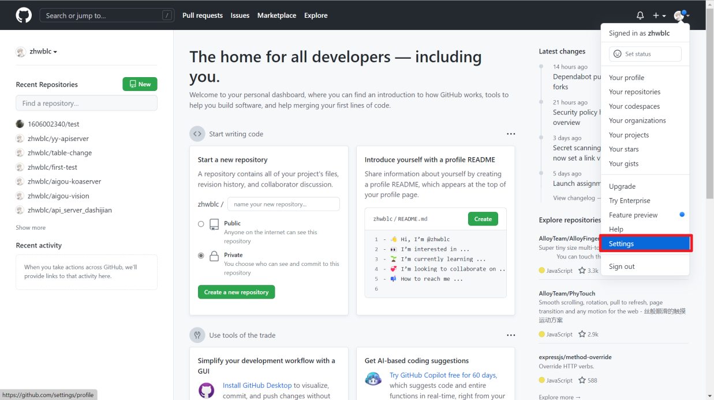

### 1、创建vue项目并且关联远程github仓库

#### 我这里创建的是table-change

### 2、创建并关联token

#### 创建token



.png)

.png)

#### 创建token的选中项

填写note，这个可以自己定义
选中repo权限
.png)
然后拖到最后选择创建，创建完成后只能看到一次token值，必须复制出来保存
.png)
.png)

#### 把刚才复制出来的token添加到需要管理的仓库中

.png)
.png)

#### 创建actions变量

这里的Name是变量名字之后的actions里面会用到这个变量
.png)

### 3、在远程github仓库的项目中创建actions

.png)
.png)
.png)

#### 具体代码

可以直接粘贴进去

```cmd
# 该workflow的名称，可以随意填写
name: Build And Deploy To Github Pages

# workflow的触发事件，这里代表main分支的push事件触发
on:
  push:
    branches: [ main ]

# 任务
jobs:
  # build-and-deploy 为任务的ID
  build-and-deploy:
    # 运行所需要的环境
    runs-on: ubuntu-latest 

    steps:
      # 步骤名
      - name: Checkout
        # 使用的actions脚本，这里是官方提供的获取源码脚本
        uses: actions/checkout@v3

      # 执行npm脚本打包项目
      - name: Install and Build
        run: |
          npm install --force
          npm run build
      
      # 执行crazy-max/ghaction-github-pages将项目发布到Github Pages
      - name: Deploy to GitHub Pages
        if: success()
        uses: crazy-max/ghaction-github-pages@v3
        with:
   # 发布到的分支
          target_branch: gh-pages
   # 发布到的目录
          build_dir: dist
        env:
  # 关联的token，这里填写之前创建的action变量
          GITHUB_TOKEN: ${{ secrets.VUETOKEN }}
```

以上代码中的VUETOKEN，是之前自己配置的actions变量
.png)


创建完成后，查看自己code多了个文件，就是刚刚创建的action的文件目录，之后如果需要修改，可以在这里直接修改
.png)

### 4、查看已创建的action是否正常工作

#### 提交更改代码测试如下

现在可以提交一下更改的代码，然后查看以下画面是否正常工作，如果正常，右下方列表应该是通过的标识--绿色的对钩。
.png)

也可以点击进入查看具体的执行过程
.png)
.png)
.png)


#### 注意：自动部署成功后需要等待一会儿，github pages 才会刷新