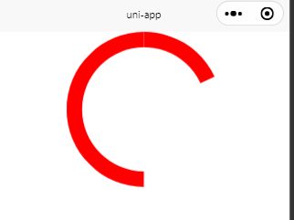

## 兼容小程序

### 说明

#### 采用view组件+css的写法

1. 这里不采用canvas，因为微信小程序中，canvas有层级问题
2. 这里不采用svg，因为微信小程序不兼容

#### 实现效果：

在微信开发者工具中，会有一点缝隙，在实机演示里面没有



### 样式相关说明
关于以下代码行内样式style绑定方式，请参考 [关于动态绑定style](../styleAbout/styleAbout.md)


相关代码如下:

```vue
<template>
	<view class='com-circle-progress'>
		<view class="left" :style="[boxStyle]">
			<view class="leftcircle" :style="[leftStyle]"></view>
		</view>
		<view class="right" :style="[boxStyle]">
			<view class="rightcircle" :style="[rightStyle]"></view>
		</view>

		<view class="custom-box" :style="[customBoxStyle]">
			<slot></slot>
		</view>
	</view>
</template>

<script>
	export default {
		name: "com-circle-progress",
		props: {
			// 进度
			percent: {
				type: Number,
				default: 100
			},
			// 圆环的颜色
			activeColor: {
				type: String,
				default: 'orange'
			},
			// 圆环的宽度
			borderWidth: {
				type: Number,
				default: 40
			},
			// 圆环的大小
			width: {
				type: Number,
				default: 400
			}
		},
		data() {
			return {
				rotItem: 360 / 100,
				// boxStyle: {width: '200px', height: '200px', backgroundColor: 'red'}
			};
		},
		computed: {
			customBoxStyle() {
				return {
					width: this.width + 'rpx',
					height: this.width + 'rpx'
				}
			},
			boxStyle() {
				return {
					width: this.width / 2 + 'rpx',
					height: this.width + 'rpx'
				}
			},
			leftStyle() {
				let rot = 45
				if (this.percent < 50 && this.percent >= 0) {
					rot = Math.ceil(this.rotItem * this.percent - 135)
				}
				return {
					borderBottomColor: this.activeColor,
					borderLeftColor: this.activeColor,
					width: this.width + 'rpx',
					height: this.width + 'rpx',
					borderWidth: this.borderWidth + 'rpx',
					transform: `rotate(${rot}deg)`
				}
			},
			rightStyle() {
				let rot = -135
				if (this.percent > 50 && this.percent < 100) {
					rot = Math.ceil((this.percent - 50) * this.rotItem - 135)
				} else if (this.percent === 100) {
					rot = 45
				}
				return {
					borderTopColor: this.activeColor,
					borderRightColor: this.activeColor,
					width: this.width + 'rpx',
					height: this.width + 'rpx',
					borderWidth: this.borderWidth + 'rpx',
					transform: `rotate(${rot}deg)`
				}
			}
		},
		created() {}
	}
</script>

<style lang="scss" scoped>
	.com-circle-progress {
		position: relative;
		display: flex;

		.custom-box {
			position: absolute;
			left: 0;
			top: 0;

			display: flex;
			justify-content: center;
			align-items: center;
		}

		.left {
			margin: 0;
			width: 100px;
			height: 200px;
			position: relative;
			overflow: hidden;
			//background: pink;
		}

		.leftcircle {
			box-sizing: border-box;
			width: 200px;
			height: 200px;
			border: 20px solid white;
			position: absolute;
			border-radius: 50%;
			left: 0;
			top: 0;
			border-bottom: 20px solid orange;
			border-left: 20px solid orange;
			/* 完全显示 */
			// transform: rotate(45deg);
			/* 完全隐藏 */
			/* transform: rotate(-135deg); */

			/* animation-name:circle_left;
		    animation-duration: 2s;
		    animation-timing-function: linear;
		    animation-iteration-count: infinite; */

		}

		.right {
			margin: 0;
			width: 100px;
			height: 200px;
			position: relative;
			overflow: hidden;
			//background-color: pink;
		}

		.rightcircle {
			box-sizing: border-box;
			width: 200px;
			height: 200px;
			border-radius: 50%;
			border: 20px solid white;
			position: absolute;
			border-top: 20px solid orange;
			border-right: 20px solid orange;
			right: 0;
			top: 0;
			/* animation-name: circle_right;
		    animation-duration: 2s;
		    animation-timing-function: linear;
		    animation-iteration-count: infinite; */
			// transform: rotate(-135deg);
		}

		@keyframes circle_right {

			0%,
			50% {
				transform: rotate(-135deg);
			}

			100% {
				transform: rotate(45deg);
			}
		}

		@keyframes circle_left {
			0% {
				transform: rotate(-135deg);
			}

			50%,
			100% {
				transform: rotate(45deg);
			}
		}

	}
</style>
```

